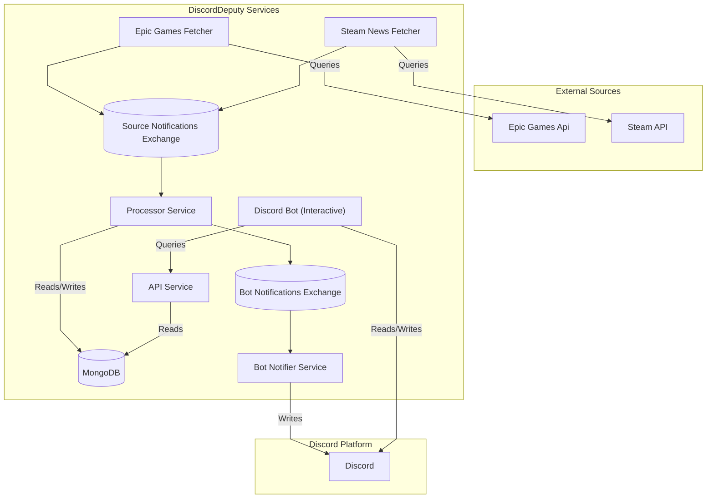

# DiscordDeputy

DiscordDeputy is a robust Discord bot designed to keep users informed about the latest free game offers from Epic Games
and news updates from Steam. It integrates with external gaming platforms, processes information, and delivers timely
notifications directly to designated Discord channels, ensuring users never miss out on new content.

The application consists of the following microservices:

* **Fetcher Services**: These services are responsible for actively retrieving data from external sources.
    * **Epic Games Offer Fetcher**: Periodically polls the Epic Games Store API to discover new free game offers.
    * **Steam News Fetcher**: Gathers news updates and announcements from Steam for specified games or categories
        * Note: this service is currently disabled and will not be enabled until the bot can be configured what stories
          to follow per discord guild.
* **Processor Service**: A message-agnostic service that consumes events from fetcher services, performs data
  filtering (e.g., duplicate detection) and prepares the data for storage and subsequent notifications. It
  processes any incoming event type (news, offers, etc.) without full knowledge of its schema.
* **API Service**: A unified RESTful interface for accessing and managing all collected data (free game offers, news,
  etc.). This service understands the various message schemas and provides endpoints to query the processed information.
* **Bot Notifier Service**: This service consumes processed notifications and dispatches them to configured Discord
  channels using the Discord API.
* **Discord Bot (Interactive)**: The primary interactive bot that listens for commands and interacts with users within
  Discord.

Additional information:

* The services communicate via RabbitMQ for asynchronous messaging.
* The Processor service persist data in a MongoDB instance. The API service reads from this MongoDB instance to respond
  to queuries.

## System Architecture

## Key Technologies and Dependencies

DiscordDeputy is built using a modern microservices architecture, leveraging the following key technologies:

* **Spring Boot**: The primary framework for building robust, stand-alone, production-grade Spring applications.
* **Spring Cloud Stream**: Facilitates building event-driven microservices, enabling seamless communication between
  services via message brokers like RabbitMQ.
* **RabbitMQ**: An open-source message broker that implements the Advanced Message Queuing Protocol (AMQP), used here
  for inter-service communication and asynchronous processing.
* **MongoDB**: A NoSQL document database used for flexible and scalable data storage.
* **Discord4J**: A reactive Discord API wrapper for Java.
* **Project Reactor**: A foundational library for building reactive, non-blocking applications on the JVM.
* **Kubernetes**: An open-source container-orchestration system for automating application deployment, scaling, and
  management in a distributed environment.
    
